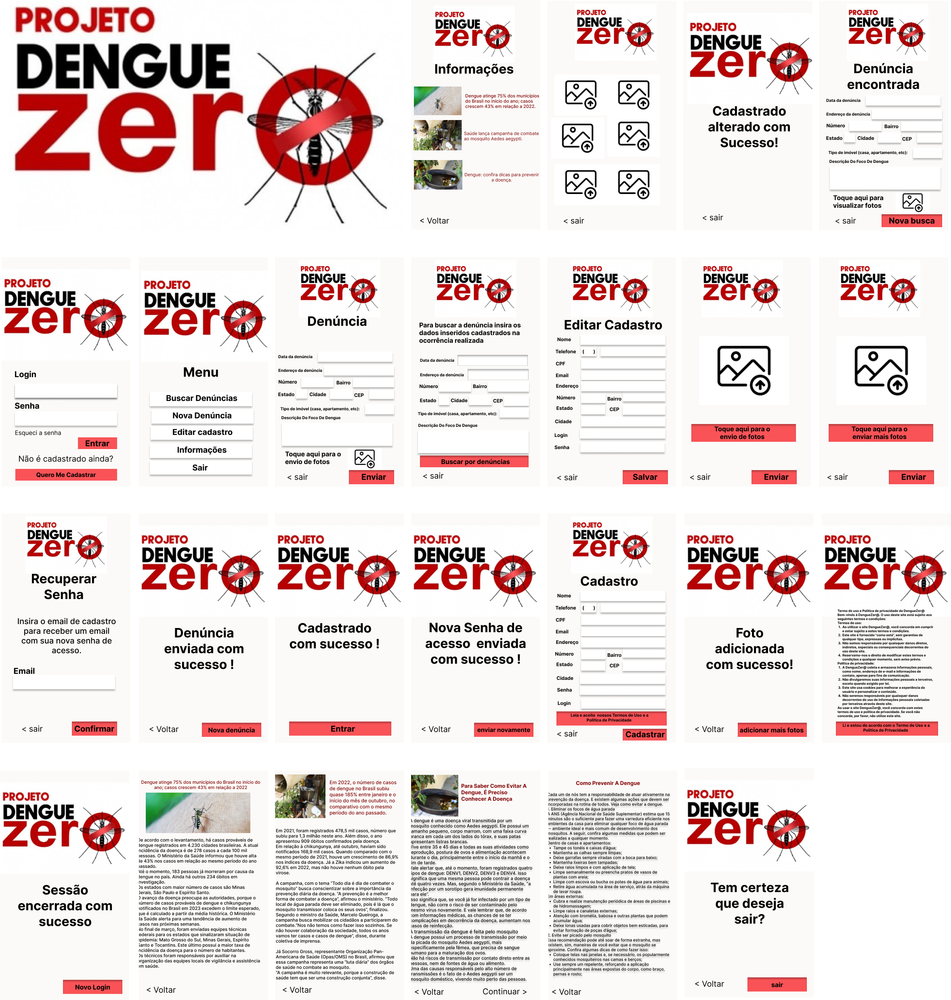

# Protótipo de Aplicativo Android - Combate à Dengue

[Link do protótipo em Figma](https://www.figma.com/proto/RLygnS3hVWtBJHHBDhhNS2/Dengue-Zero?node-id=14-6&starting-point-node-id=3%3A147&mode=design&t=yBAS6JjGASA2fjG6-1) 
 **Versão 1.0 **

### **1. Introdução**

O protótipo de aplicativo Android desenvolvido tem como objetivo facilitar o cadastro de denúncias de focos de dengue, contribuindo para o rastreamento e combate eficaz ao mosquito Aedes aegypti. Este documento fornece uma visão abrangente do protótipo, incluindo suas funcionalidades, interfaces e fluxos de usuário.

---

### **2. Visão Geral do Protótipo**

O aplicativo foi concebido para permitir que os usuários cadastrem denúncias de focos de dengue, auxiliando na identificação e eliminação de possíveis criadouros do mosquito transmissor da doença. O sistema também oferece funcionalidades para buscar denúncias existentes, editar informações de perfil e obter informações relevantes sobre a dengue.

---

### **3. Funcionalidades Principais**

#### 3.1 Tela de Login (0)

- **Campos de Entrada:**
  - Usuário ou e-mail.
  - Senha.

- **Botões:**
  - Acesso.
  - Redefinir Senha.
  - Cadastro.

#### 3.2 Menu Principal (1)

- **Opções de Navegação:**
  - Buscar Denúncias.
  - Nova Denúncia.
  - Editar Cadastro.
  - Informações.
  - Sair.

#### 3.3 Tela de Buscar Denúncias (1.1)

- **Campos:**
  - [Lista de denúncias com opções de filtro - Detalhes específicos a serem adicionados durante a implementação.]

#### 3.4 Tela de Busca de Denúncia

- **Campos de Entrada:**
  - Data da denúncia.
  - Endereço da denúncia.
  - Número.
  - Estado.
  - Cidade.
  - CEP.
  - Tipo de imóvel.
  - Descrição do Foco de Dengue.

- **Botões:**
  - Buscar por Denúncias.
  - Voltar.

#### 3.5 Tela de Nova Denúncia (1.2)

- **Campos de Entrada:**
  - Data da denúncia.
  - Endereço da denúncia.
  - Número.
  - Estado.
  - Cidade.
  - CEP.
  - Tipo de imóvel.
  - Descrição do Foco de Dengue.

- **Anexo:**
  - Evidências (fotos, vídeos, documentos).

- **Botão:**
  - Enviar Denúncia.

#### 3.6 Tela de Editar Cadastro (1.3)

- **Campos:**
  - Nome.
  - Telefone.
  - CPF.
  - Email.
  - Endereço.
  - Número.
  - Estado.
  - Cidade.
  - Login.
  - Senha.
  - CEP.

- **Botão:**
  - Salvar Alterações.

#### 3.7 Tela de Informações (1.4)

- **Conteúdo:**
  - Notícias e atualizações sobre a dengue.

#### 3.8 Botão de Saída (1.5)

- **Botão:**
  - "Sair".

---

### **4. Considerações Finais**

Este protótipo visa fornecer uma interface intuitiva e eficiente para os usuários contribuírem ativamente no combate à dengue, cadastrando denúncias e mantendo-se informados sobre a situação da doença. Durante o desenvolvimento futuro, será crucial considerar a segurança, usabilidade e feedback dos usuários para aprimorar a experiência geral.

---

*Nota: Este documento serve como base para o desenvolvimento do protótipo. Detalhes específicos, como design de interface, segurança e requisitos técnicos, devem ser tratados no decorrer do processo de implementação.*

---
[DOC em PDF da documentação do Projeto](doc.pdf)

---
### Obrigado, Professor Eduardo A. Freitas! 🚀

Gostaríamos de dar aquele shout-out especial para o [Mestre Eduardo](linkedin.com/in/eduardo-freitas-professor-ti), o mago da Engenharia de Software! 🎩✨ Sua paciência infinita e sabedoria mágica foram cruciais para transformar nosso projeto em uma obra-prima.

Nossos bits e bytes transbordam de alegria por ter você como guia nesta jornada de códigos e protótipos. Você é o verdadeiro MVP (Most Valuable Professor)!

Com gratidão e emojis de código-fonte,
A Turma do Combate à Dengue 🦟💻
